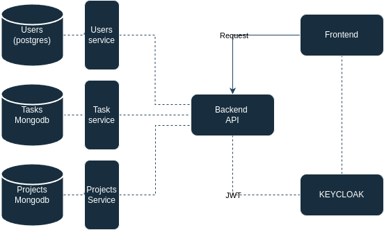

# toDoApp

Aplikacja TO DO, która umożliwia użytkownikom zarządzanie zadaniami, wspólpracowanie nad nimi z innymi użytkownikami poprzez dzielenie się zadaniami i dodawanie użytkowników do projektów.
Ponadto użytkownicy mogą eksportować i importować listy zadań do/z plików csv, xml, json.
Użytkownicy dzielą się na standardowych i administratorów, którzy moga zarządzać użytkownikami.

### Użyte technologie

1. Frontend :

- Nextjs
  |- Formik (walidacja yup)
  |- Daisyui
  |- React-Icons
  |- papaparse, xml2js (działania na plikach)
  |- next-auth

2. Backend :

- Expressjs
  |- Bcrypt
  |- JWT
  |- joi
  |- keycloak-js
  |- prisma
  |- mongoose

3. DB :

- Mongodb
  |- Mongoose
- Postgres
  |- Prisma

4. Keycloak

5. Docker

_6. Kubernetes (docelowo)_

### Diagram flow

